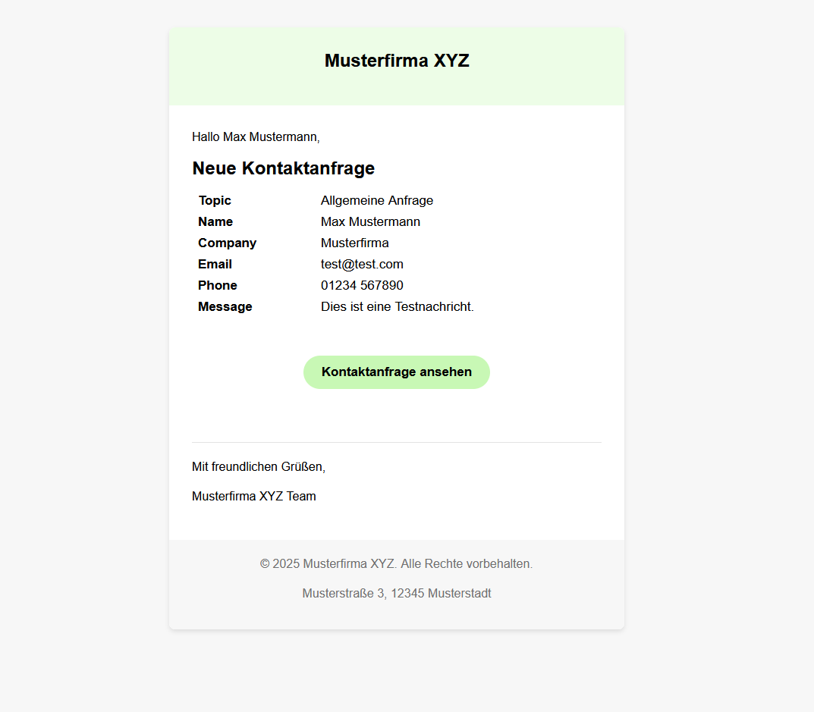

# silverstripe-templated-emails

A SilverStripe module that provides a unified, theme‑ready email template and automatically renders form data as a table—no manual HTML needed.



## Installation

1. Install the package (in your project directory):
   
   ```bash
   composer require moritz-sauer-13/silverstripe-templated-emails
   ```
2. Update database/manifest:
   
   - run /dev/build?flush=all

> Requirements: SilverStripe CMS 5.x

## Quick start

```php
use SilverStripe\Control\Email\Email;
use TemplatedMails\Model\TemplatedEmail;

$email = TemplatedEmail::create()
    ->setTo('to@example.com')
    ->setFrom(Email::config()->admin_email)
    ->setSubject('Contact request')
    ->setGreeting('Hello,')
    ->setTitle('New contact request')
    ->setFormData($data, $form);

$email->send();
```

- If a `$form` is provided, the order and labels are derived from the form fields.
- Additional free text/HTML can still be set via `$email->setBody()` and rendered in the template with `$EmailContent.RAW`.

## Configuration (YAML)

Keys and defaults:

- skip_empty: true — Skip empty fields (default)
- excludes: ["SecurityID", "url", "g-recaptcha-response"] — Exclude exact key names
- exclude_prefixes: ["action_"] — Exclude all keys starting with any of these prefixes
- array_separator: ", " — Separator for array values
- label_from_placeholder: true — Use placeholder as label when Title is empty
- strip_required_asterisk: true — Remove trailing asterisk on required field labels

Example app/_config/email.yml:

```yml
TemplatedMails\Model\TemplatedEmail:
  skip_empty: true
  excludes:
    - SecurityID
    - url
    - g-recaptcha-response
  exclude_prefixes:
    - 'action_'
  array_separator: ', '
  label_from_placeholder: true
  strip_required_asterisk: true
```
